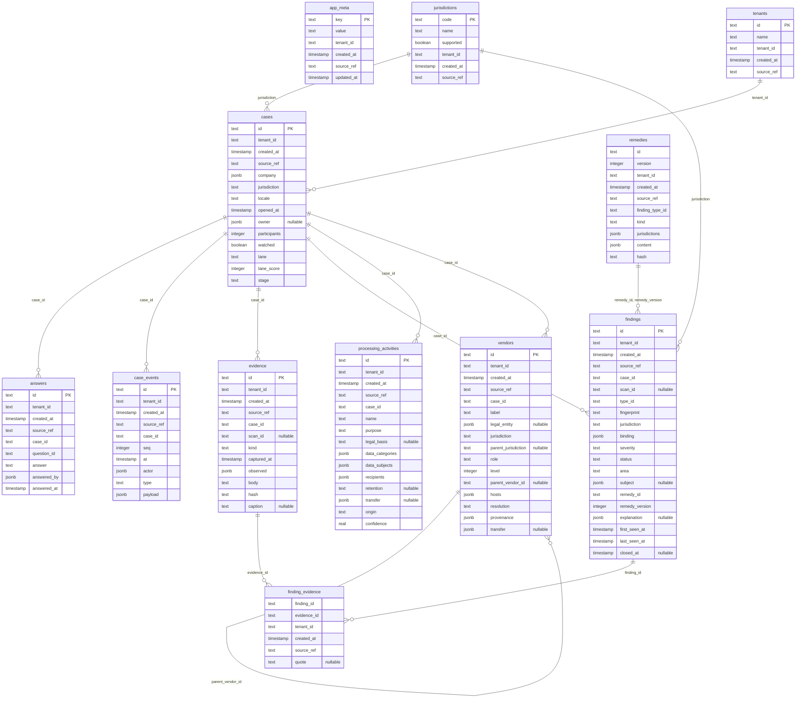

# Schema

Generated from `packages/db/migrations/meta/0001_snapshot.json` by `scripts/schema-doc.mjs`.
Do not edit; change `packages/db/src/schema.ts`, run `pnpm db:generate`, then `pnpm db:doc`.

Every table carries `tenant_id`, `created_at` and `source_ref`. `case_events` and
`evidence` refuse UPDATE and DELETE; `findings.remedy_id` is NOT NULL.

## answers

| Column | Type | Constraints |
| --- | --- | --- |
| id | text | primary key, not null |
| tenant_id | text | not null |
| created_at | timestamp with time zone | not null, default now() |
| source_ref | text | not null |
| case_id | text | not null |
| question_id | text | not null |
| answer | text | not null |
| answered_by | jsonb | not null |
| answered_at | timestamp with time zone | not null |

- case_id → cases(id)
- unique index answers_case_question (case_id, question_id)

## app_meta

| Column | Type | Constraints |
| --- | --- | --- |
| key | text | primary key, not null |
| value | text | not null |
| tenant_id | text | not null |
| created_at | timestamp with time zone | not null, default now() |
| source_ref | text | not null |
| updated_at | timestamp with time zone | not null, default now() |

## case_events

| Column | Type | Constraints |
| --- | --- | --- |
| id | text | primary key, not null |
| tenant_id | text | not null |
| created_at | timestamp with time zone | not null, default now() |
| source_ref | text | not null |
| case_id | text | not null |
| seq | integer | not null |
| at | timestamp with time zone | not null |
| actor | jsonb | not null |
| type | text | not null |
| payload | jsonb | not null, default '{}'::jsonb |

- case_id → cases(id)
- unique index case_events_case_seq (case_id, seq)
- index case_events_tenant_idx (tenant_id)
- check case_events_seq: `"case_events"."seq" >= 1`
- check case_events_type: `"type" in ('case_opened', 'scan_started', 'scan_completed', 'scan_failed', 'finding_raised', 'finding_closed', 'finding_regressed', 'fix_verification_failed', 'check_undetermined', 'question_asked', 'question_answered', 'artefact_generated', 'artefact_published', 'colleague_invited', 'colleague_joined', 'reminder_sent', 'watch_run', 'meeting_requested', 'note_added', 'claim_rejected', 'vendor_resolved')`

## cases

| Column | Type | Constraints |
| --- | --- | --- |
| id | text | primary key, not null |
| tenant_id | text | not null |
| created_at | timestamp with time zone | not null, default now() |
| source_ref | text | not null |
| company | jsonb | not null |
| jurisdiction | text | not null |
| locale | text | not null |
| opened_at | timestamp with time zone | not null |
| owner | jsonb |  |
| participants | integer | not null, default 0 |
| watched | boolean | not null, default false |
| lane | text | not null |
| lane_score | integer | not null, default 0 |
| stage | text | not null, default 'opened' |

- jurisdiction → jurisdictions(code)
- tenant_id → tenants(id)
- index cases_tenant_idx (tenant_id)
- check cases_id: `"cases"."id" ~ '^[A-Z]{2}-[0-9]{2}-[A-Z0-9]{4}$'`
- check cases_lane: `"lane" in ('self-serve', 'human')`
- check cases_stage: `"stage" in ('opened', 'assessed', 'working', 'documented', 'watched')`
- check cases_lane_score: `"cases"."lane_score" between 0 and 100`

## evidence

| Column | Type | Constraints |
| --- | --- | --- |
| id | text | primary key, not null |
| tenant_id | text | not null |
| created_at | timestamp with time zone | not null, default now() |
| source_ref | text | not null |
| case_id | text | not null |
| scan_id | text |  |
| kind | text | not null |
| captured_at | timestamp with time zone | not null |
| observed | jsonb | not null, default '{}'::jsonb |
| body | text | not null |
| hash | text | not null |
| caption | text |  |

- case_id → cases(id)
- unique index evidence_tenant_hash (tenant_id, hash)
- index evidence_case_idx (case_id)
- check evidence_hash: `"evidence"."hash" ~ '^[a-f0-9]{64}$'`
- check evidence_id: `"evidence"."id" = "evidence"."kind" || ':' || left("evidence"."hash", 16)`
- check evidence_kind: `"kind" in ('http_request', 'cookie', 'storage', 'dom_snapshot', 'screenshot', 'header', 'form', 'document', 'pass_diff', 'registry_record', 'answer', 'text')`

## finding_evidence

| Column | Type | Constraints |
| --- | --- | --- |
| finding_id | text | not null |
| evidence_id | text | not null |
| tenant_id | text | not null |
| created_at | timestamp with time zone | not null, default now() |
| source_ref | text | not null |
| quote | text |  |

- primary key (finding_id, evidence_id)
- finding_id → findings(id)
- evidence_id → evidence(id)

## findings

| Column | Type | Constraints |
| --- | --- | --- |
| id | text | primary key, not null |
| tenant_id | text | not null |
| created_at | timestamp with time zone | not null, default now() |
| source_ref | text | not null |
| case_id | text | not null |
| scan_id | text |  |
| type_id | text | not null |
| fingerprint | text | not null |
| jurisdiction | text | not null |
| binding | jsonb | not null |
| severity | text | not null |
| status | text | not null, default 'open' |
| area | text | not null |
| subject | jsonb |  |
| remedy_id | text | not null |
| remedy_version | integer | not null |
| explanation | jsonb |  |
| first_seen_at | timestamp with time zone | not null |
| last_seen_at | timestamp with time zone | not null |
| closed_at | timestamp with time zone |  |

- case_id → cases(id)
- jurisdiction → jurisdictions(code)
- remedy_id, remedy_version → remedies(id, version)
- unique index findings_case_fingerprint (case_id, fingerprint)
- index findings_tenant_idx (tenant_id)
- check findings_type: `"findings"."type_id" ~ '^[A-Z]{2,4}-[0-9]{2}$'`
- check findings_severity: `"severity" in ('blocking', 'serious', 'advisory')`
- check findings_status: `"status" in ('open', 'working', 'closed', 'regressed')`
- check findings_area: `"area" in ('Consent', 'Contracts', 'Security', 'Transfers', 'Observation', 'Notice', 'Recipients', 'Collection')`
- check findings_closed: `("findings"."status" = 'closed') = ("findings"."closed_at" is not null)`

## jurisdictions

| Column | Type | Constraints |
| --- | --- | --- |
| code | text | primary key, not null |
| name | text | not null |
| supported | boolean | not null, default false |
| tenant_id | text | not null |
| created_at | timestamp with time zone | not null, default now() |
| source_ref | text | not null |

- check jurisdictions_code: `"jurisdictions"."code" ~ '^(EU|[A-Z]{2})$'`

## processing_activities

| Column | Type | Constraints |
| --- | --- | --- |
| id | text | primary key, not null |
| tenant_id | text | not null |
| created_at | timestamp with time zone | not null, default now() |
| source_ref | text | not null |
| case_id | text | not null |
| name | text | not null |
| purpose | text | not null |
| legal_basis | text |  |
| data_categories | jsonb | not null, default '[]'::jsonb |
| data_subjects | jsonb | not null, default '[]'::jsonb |
| recipients | jsonb | not null, default '[]'::jsonb |
| retention | text |  |
| transfer | jsonb |  |
| origin | text | not null |
| confidence | real | not null, default 1 |

- case_id → cases(id)
- index processing_activities_case_idx (case_id)
- check processing_activities_origin: `"origin" in ('derived', 'asserted', 'answered')`
- check processing_activities_confidence: `"processing_activities"."confidence" between 0 and 1`

## remedies

| Column | Type | Constraints |
| --- | --- | --- |
| id | text | not null |
| version | integer | not null |
| tenant_id | text | not null |
| created_at | timestamp with time zone | not null, default now() |
| source_ref | text | not null |
| finding_type_id | text | not null |
| kind | text | not null |
| jurisdictions | jsonb | not null |
| content | jsonb | not null |
| hash | text | not null |

- primary key (id, version)
- check remedies_version: `"remedies"."version" >= 1`
- check remedies_kind: `"kind" in ('self_fix', 'generated_artefact', 'our_product', 'partner_alternative', 'no_solution')`
- check remedies_finding_type: `"remedies"."finding_type_id" ~ '^[A-Z]{2,4}-[0-9]{2}$'`

## tenants

| Column | Type | Constraints |
| --- | --- | --- |
| id | text | primary key, not null |
| name | text | not null |
| tenant_id | text | not null |
| created_at | timestamp with time zone | not null, default now() |
| source_ref | text | not null |

- check tenants_self: `"tenants"."tenant_id" = "tenants"."id"`

## vendors

| Column | Type | Constraints |
| --- | --- | --- |
| id | text | primary key, not null |
| tenant_id | text | not null |
| created_at | timestamp with time zone | not null, default now() |
| source_ref | text | not null |
| case_id | text | not null |
| label | text | not null |
| legal_entity | jsonb |  |
| jurisdiction | text | not null |
| parent_jurisdiction | text |  |
| role | text | not null |
| level | integer | not null, default 1 |
| parent_vendor_id | text |  |
| hosts | jsonb | not null, default '[]'::jsonb |
| resolution | text | not null |
| provenance | jsonb | not null |
| transfer | jsonb |  |

- case_id → cases(id)
- parent_vendor_id → vendors(id)
- index vendors_case_idx (case_id)
- check vendors_role: `"role" in ('processor', 'sub_processor', 'joint_controller', 'independent_controller', 'unknown')`
- check vendors_resolution: `"resolution" in ('resolved', 'unresolved', 'ambiguous')`
- check vendors_level: `"vendors"."level" >= 0`

